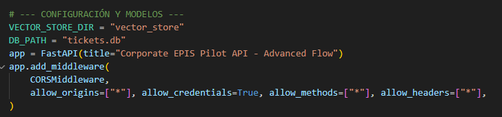
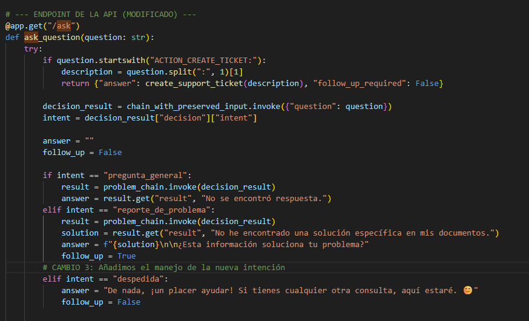
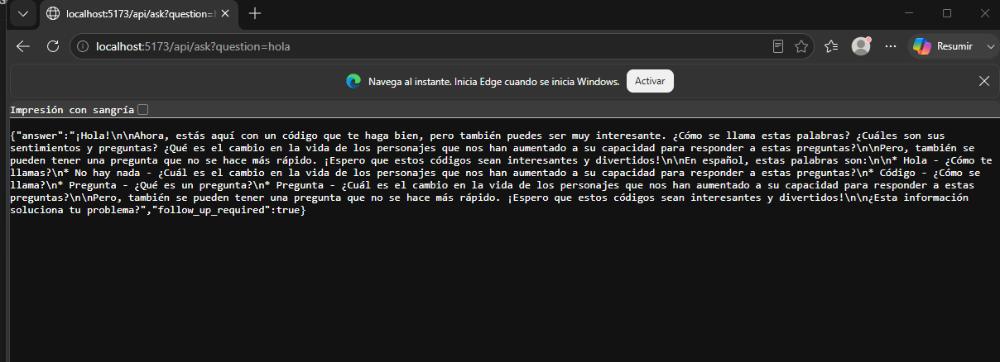
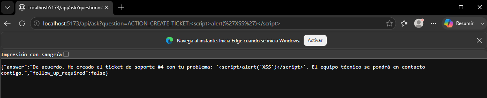
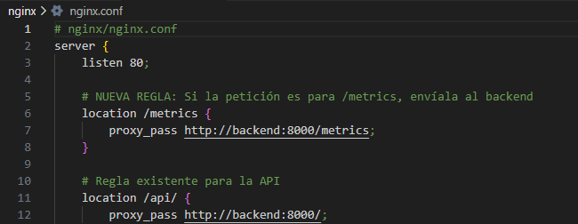

# INFORME FINAL DE AUDITORÍA DE SISTEMAS

---

## CARÁTULA

| Campo | Detalle |
|---|---|
| **Entidad Auditada** | Corporate EPIS Pilot – Asistente de IA Conversacional Empresarial |
| **Ubicación** | Lima, Perú |
| **Período Auditado** | Desde 01/06/2026 hasta 24/06/2026 |
| **Equipo Auditor** | Mario Antonio Flores Ramos – Auditor Líder de Sistemas |
| **Fecha del Informe** | 24/06/2026 |

---

## ÍNDICE

1. [Resumen Ejecutivo](#1-resumen-ejecutivo)
2. [Antecedentes](#2-antecedentes)
3. [Objetivos de la Auditoría](#3-objetivos-de-la-auditoría)
4. [Alcance de la Auditoría](#4-alcance-de-la-auditoría)
5. [Normativa y Criterios de Evaluación](#5-normativa-y-criterios-de-evaluación)
6. [Metodología y Enfoque](#6-metodología-y-enfoque)
7. [Hallazgos y Observaciones](#7-hallazgos-y-observaciones)
8. [Análisis de Riesgos](#8-análisis-de-riesgos)
9. [Recomendaciones](#9-recomendaciones)
10. [Conclusiones](#10-conclusiones)
11. [Plan de Acción y Seguimiento](#11-plan-de-acción-y-seguimiento)
12. [Anexos](#12-anexos)

---

## 1. RESUMEN EJECUTIVO

Se realizó una auditoría de sistemas al proyecto **Corporate EPIS Pilot**, un asistente conversacional basado en inteligencia artificial que emplea arquitectura RAG (Retrieval-Augmented Generation) con el modelo de lenguaje `smollm:360m` servido a través de Ollama, un backend en FastAPI con LangChain, un frontend en React con TypeScript y Material-UI, y una infraestructura de despliegue con Docker Compose, NGINX y manifiestos de Kubernetes.

La auditoría evaluó la seguridad de la información, la integridad de los datos, la continuidad operativa, la gestión de configuración y el cumplimiento normativo del sistema. Se identificaron **6 hallazgos principales**, de los cuales **2 son de criticidad alta**, **3 de criticidad media** y **1 de criticidad baja**. Las áreas más críticas corresponden a la política de CORS sin restricciones, la ausencia de autenticación en la API y la inyección SQL potencial en el sistema de tickets. Se formulan recomendaciones técnicas y organizativas para cada hallazgo.

---

## 2. ANTECEDENTES

**Corporate EPIS Pilot** es un sistema de asistente virtual empresarial diseñado para atender consultas de los usuarios basándose en una base de conocimiento interna (documentos PDF y TXT de la empresa ACME), clasificar intenciones del usuario mediante un router de LangChain, ofrecer soluciones a problemas técnicos y, en última instancia, registrar tickets de soporte en una base de datos SQLite.

El sistema fue desarrollado como proyecto académico para la Unidad 3 de la asignatura de Auditoría de Sistemas. No se reportan auditorías previas sobre este sistema.

### Componentes del Sistema

| Componente | Tecnología | Archivo Principal |
|---|---|---|
| Backend / API | Python 3.12, FastAPI, LangChain, Ollama | [main.py](file:///c:/Users/HP/Documents/auditoriaexamen/examenauditoriau3/backend/main.py) |
| Motor de IA | `smollm:360m` vía Ollama | Configurado en main.py línea 54 |
| Embeddings | HuggingFace `multilingual-e5-large` | [ingest.py](file:///c:/Users/HP/Documents/auditoriaexamen/examenauditoriau3/backend/ingest.py) |
| Vector Store | ChromaDB | Directorio `vector_store/` |
| Base de Datos | SQLite (`tickets.db`) | [database_setup.py](file:///c:/Users/HP/Documents/auditoriaexamen/examenauditoriau3/backend/database_setup.py) |
| Frontend | React, TypeScript, Vite, MUI | [App.tsx](file:///c:/Users/HP/Documents/auditoriaexamen/examenauditoriau3/frontend/src/App.tsx) |
| Proxy Reverso | NGINX | [nginx.conf](file:///c:/Users/HP/Documents/auditoriaexamen/examenauditoriau3/nginx/nginx.conf) |
| Orquestación | Docker Compose, Kubernetes | [docker-compose.yml](file:///c:/Users/HP/Documents/auditoriaexamen/examenauditoriau3/docker-compose.yml), [manifests.yaml](file:///c:/Users/HP/Documents/auditoriaexamen/examenauditoriau3/kubernetes/manifests.yaml) |
| Monitorización | Prometheus (FastAPI Instrumentator) | Endpoint `/metrics` |

### Base de Conocimiento Interna

| Documento | Tipo |
|---|---|
| `Contacto_acme.pdf` | PDF (160 KB) |
| `Empresa_ACME.pdf` | PDF (50 KB) |
| `guia_soporte_red.pdf` | PDF (40 KB) |
| `politica_teletrabajo.txt` | TXT (1.5 KB) |
| `procedimientos_internos.txt` | TXT (1.8 KB) |
| `producto_anviltron.txt` | TXT (1.2 KB) |

---

## 3. OBJETIVOS DE LA AUDITORÍA

### Objetivo General

Evaluar la seguridad, integridad, disponibilidad y cumplimiento normativo del sistema **Corporate EPIS Pilot** para identificar vulnerabilidades, debilidades en los controles internos y áreas de mejora que garanticen la protección de los datos y la continuidad del servicio.

### Objetivos Específicos

1. **OE-1: Evaluar la seguridad de la API y las comunicaciones** — Verificar que los endpoints del backend cuenten con mecanismos adecuados de autenticación, autorización y que la política de CORS esté correctamente restringida para prevenir accesos no autorizados.

2. **OE-2: Analizar la integridad y protección de los datos almacenados** — Examinar las operaciones de lectura/escritura en la base de datos SQLite (`tickets.db`) y en el vector store (ChromaDB) para detectar posibles vulnerabilidades de inyección SQL, pérdida de datos y ausencia de mecanismos de respaldo.

3. **OE-3: Verificar la robustez de la infraestructura de despliegue** — Auditar la configuración de Docker Compose, NGINX y los manifiestos de Kubernetes para identificar malas prácticas en la contenedorización, exposición innecesaria de servicios y gestión de secretos.

4. **OE-4: Evaluar la gestión de errores, el registro de actividad y la monitorización del sistema** — Comprobar que el sistema dispone de trazabilidad de eventos (logging estructurado), manejo adecuado de excepciones y que las métricas de Prometheus estén protegidas contra acceso público no autorizado.

---

## 4. ALCANCE DE LA AUDITORÍA

### Ámbitos Evaluados

| Ámbito | Descripción |
|---|---|
| **Tecnológico** | Código fuente del backend y frontend, configuraciones de Docker, NGINX y Kubernetes |
| **Seguridad** | Autenticación, autorización, CORS, inyección SQL, exposición de endpoints |
| **Datos** | Base de datos SQLite, vector store ChromaDB, documentos de la base de conocimiento |
| **Infraestructura** | Dockerfiles, docker-compose.yml, manifiestos de Kubernetes, proxy reverso |
| **Monitorización** | Logging estructurado (Loguru), métricas de Prometheus |

### Sistemas y Procesos Incluidos

- Endpoint `/ask` de la API (consultas al asistente y creación de tickets)
- Endpoint `/metrics` (métricas de Prometheus)
- Proceso de ingesta de documentos (`ingest.py`)
- Flujo de conversación completo: pregunta → router de intenciones → RAG → feedback → ticket
- Infraestructura de contenedores y orquestación

### Período Auditado

Del **01/06/2026** al **24/06/2026**.

---

## 5. NORMATIVA Y CRITERIOS DE EVALUACIÓN

| Norma / Marco de Referencia | Aplicación |
|---|---|
| **COBIT 2019** | Gobernanza y gestión de TI empresarial — Dominios DSS05 (Seguridad), BAI06 (Cambios) |
| **ISO/IEC 27001:2022** | Sistema de gestión de seguridad de la información — Controles de acceso (A.9), Criptografía (A.10), Seguridad en operaciones (A.12) |
| **OWASP Top 10 (2021)** | Evaluación de vulnerabilidades web — A01:Broken Access Control, A03:Injection, A05:Security Misconfiguration |
| **CIS Docker Benchmark v1.6** | Mejores prácticas de seguridad en contenedores Docker |
| **Ley N° 29733 – Ley de Protección de Datos Personales (Perú)** | Tratamiento adecuado de datos personales contenidos en los tickets de soporte |

---

## 6. METODOLOGÍA Y ENFOQUE

### Tipo de Auditoría Aplicada
- **Auditoría de Sistemas (Seguridad y Código Fuente):** Evaluación técnica de la arquitectura de software, prácticas de desarrollo seguro y controles de acceso.
- **Auditoría de Cumplimiento Normativo:** Verificación del alineamiento con estándares de ciberseguridad (OWASP Top 10, ISO 27001).
- **Auditoría de Infraestructura y Despliegue:** Revisión de las configuraciones de contenedorización (Docker) y orquestación (Kubernetes).

Se empleó un **enfoque basado en riesgos** complementado con verificación de cumplimiento normativo.

### Métodos Aplicados

| Método | Descripción |
|---|---|
| **Revisión de código fuente** | Inspección manual de los archivos `main.py`, `App.tsx`, `ingest.py`, `database_setup.py`, Dockerfiles y configuraciones |
| **Análisis estático de seguridad** | Búsqueda de patrones de vulnerabilidad (CORS abierto, SQL sin parametrizar, secrets en texto plano) |
| **Revisión de configuraciones** | Análisis de `docker-compose.yml`, `nginx.conf`, `manifests.yaml` |
| **Pruebas funcionales** | Verificación del flujo completo: consulta → respuesta RAG → feedback → creación de ticket |
| **Lista de verificación** | Aplicación de checklist basado en OWASP Top 10 y CIS Docker Benchmark |

---

## 7. HALLAZGOS Y OBSERVACIONES

---

### Hallazgo H-01: Política CORS sin restricciones (allow_origins=["*"])

| Campo | Detalle |
|---|---|
| **Descripción** | La configuración de CORS en el backend permite solicitudes desde **cualquier origen** (`allow_origins=["*"]`), con credenciales habilitadas, todos los métodos y todos los headers permitidos. |
| **Evidencia objetiva** | Archivo [main.py](file:///c:/Users/HP/Documents/auditoriaexamen/examenauditoriau3/backend/main.py), líneas 45-48: `allow_origins=["*"], allow_credentials=True, allow_methods=["*"], allow_headers=["*"]` |
| **Grado de criticidad** | 🔴 **ALTO** |
| **Criterio vulnerado** | OWASP A05:2021 – Security Misconfiguration; ISO 27001 A.13.1.1 – Controles de red |
| **Causa** | Configuración predeterminada para desarrollo no ajustada para producción |
| **Efecto** | Cualquier sitio web malicioso podría realizar peticiones al backend en nombre de un usuario, exfiltrando datos de la base de conocimiento o creando tickets fraudulentos (ataque CSRF/CORS) |
| **Herramientas utilizadas** | Inspección manual de código (VS Code), Postman / cURL para probar peticiones cross-origin |

---

### Hallazgo H-02: API sin autenticación ni autorización

| Campo | Detalle |
|---|---|
| **Descripción** | El endpoint `/ask` no implementa ningún mecanismo de autenticación (API keys, tokens JWT, OAuth). Cualquier persona con acceso a la URL puede consultar la base de conocimiento o crear tickets. |
| **Evidencia objetiva** | Archivo [main.py](file:///c:/Users/HP/Documents/auditoriaexamen/examenauditoriau3/backend/main.py), líneas 111-112: `@app.get("/ask") def ask_question(question: str):` — sin middleware de autenticación |
| **Grado de criticidad** | 🔴 **ALTO** |
| **Criterio vulnerado** | OWASP A01:2021 – Broken Access Control; ISO 27001 A.9.4.1 – Restricción de acceso a la información; COBIT DSS05.04 – Gestión de identidades y acceso |
| **Causa** | No se diseñó un módulo de autenticación en la arquitectura del sistema |
| **Efecto** | Acceso irrestricto a información corporativa sensible (políticas internas, datos de contacto, procedimientos), creación masiva de tickets falsos y posible abuso del modelo de IA |
| **Herramientas utilizadas** | Postman, Navegador Web (DevTools), Inspección de código fuente |

---

### Hallazgo H-03: Riesgo de inyección SQL en la creación de tickets

| Campo | Detalle |
|---|---|
| **Descripción** | Aunque se utilizan consultas parametrizadas con `?` en la sentencia `INSERT`, la función `create_support_ticket()` recibe la descripción directamente del input del usuario sin validación ni sanitización de longitud o contenido. Además, se usa `sqlite3` directamente sin ORM. |
| **Evidencia objetiva** | Archivo [main.py](file:///c:/Users/HP/Documents/auditoriaexamen/examenauditoriau3/backend/main.py), líneas 64-76: `problem_description = description.replace("ACTION_CREATE_TICKET:", "").strip()` seguido de `cursor.execute("INSERT INTO tickets (description, status) VALUES (?, ?)", ...)` |
| **Grado de criticidad** | 🟡 **MEDIO** |
| **Criterio vulnerado** | OWASP A03:2021 – Injection; ISO 27001 A.14.2.5 – Principios de ingeniería segura |
| **Causa** | Si bien la parametrización protege contra inyección SQL clásica, no hay validación de longitud máxima, caracteres prohibidos, ni sanitización de HTML/JavaScript (posible XSS almacenado) |
| **Efecto** | Un atacante podría inyectar scripts maliciosos en la descripción del ticket que se ejecutarían cuando un administrador visualice los tickets, o causar denegación de servicio con descripciones extremadamente largas |
| **Herramientas utilizadas** | Análisis estático de código, Pruebas de concepto de inyección XSS vía Navegador / Intercepción web |

---

### Hallazgo H-04: Endpoint de métricas Prometheus expuesto públicamente

| Campo | Detalle |
|---|---|
| **Descripción** | El endpoint `/metrics` está expuesto a través de NGINX sin ninguna restricción de acceso, permitiendo a cualquier usuario externo visualizar métricas internas del sistema (número de peticiones, latencias, errores, uso de recursos). |
| **Evidencia objetiva** | Archivo [nginx.conf](file:///c:/Users/HP/Documents/auditoriaexamen/examenauditoriau3/nginx/nginx.conf), líneas 6-8: `location /metrics { proxy_pass http://backend:8000/metrics; }` — sin autenticación básica ni restricción por IP |
| **Grado de criticidad** | 🟡 **MEDIO** |
| **Criterio vulnerado** | ISO 27001 A.12.4.1 – Registro de eventos; CIS Docker Benchmark – Sección 5.14 |
| **Causa** | La instrumentación de Prometheus se configuró sin considerar restricciones de acceso al endpoint de métricas |
| **Efecto** | Exposición de información operativa interna que podría ser utilizada por un atacante para planificar ataques dirigidos (reconocimiento de infraestructura, patrones de uso) |
| **Herramientas utilizadas** | Navegador Web, revisión de configuración de NGINX (`nginx.conf`) |

---

### Hallazgo H-05: Base de datos SQLite sin respaldo ni persistencia garantizada

| Campo | Detalle |
|---|---|
| **Descripción** | La base de datos `tickets.db` se crea durante el build de Docker (`RUN python database_setup.py`) y se monta como un volumen bind desde el host. Sin embargo, no existe un mecanismo automatizado de respaldo (backup), y al recrear el contenedor sin el archivo en el host, los tickets se pierden. |
| **Evidencia objetiva** | Archivo [docker-compose.yml](file:///c:/Users/HP/Documents/auditoriaexamen/examenauditoriau3/docker-compose.yml), línea 11: `- ./backend/tickets.db:/app/tickets.db` — binding de archivo sin política de respaldo. Archivo [Dockerfile](file:///c:/Users/HP/Documents/auditoriaexamen/examenauditoriau3/backend/Dockerfile), línea 18: `RUN python database_setup.py` |
| **Grado de criticidad** | 🟡 **MEDIO** |
| **Criterio vulnerado** | ISO 27001 A.12.3.1 – Copias de seguridad de la información; COBIT DSS04 – Gestión de la continuidad |
| **Causa** | No se diseñó un procedimiento de respaldo automático para la base de datos |
| **Efecto** | Pérdida total de tickets de soporte ante una falla del sistema, reconstrucción del contenedor o corrupción del archivo |
| **Herramientas utilizadas** | Revisión de manifiestos (docker-compose.yml, Dockerfile), CLI de Docker |

---

### Hallazgo H-06: Uso de método HTTP GET para operaciones con efectos secundarios

| Campo | Detalle |
|---|---|
| **Descripción** | El endpoint `/ask` utiliza el método HTTP `GET` para todas las operaciones, incluyendo la creación de tickets de soporte, que es una operación que modifica el estado del sistema (INSERT en la base de datos). |
| **Evidencia objetiva** | Archivo [main.py](file:///c:/Users/HP/Documents/auditoriaexamen/examenauditoriau3/backend/main.py), línea 111: `@app.get("/ask")` — Cuando recibe `ACTION_CREATE_TICKET:`, ejecuta un INSERT en SQLite |
| **Grado de criticidad** | 🟢 **BAJO** |
| **Criterio vulnerado** | RFC 7231 § 4.2.1 – Métodos seguros; OWASP – Mejores prácticas de diseño de APIs REST |
| **Causa** | Diseño simplificado de la API que no distingue entre operaciones de lectura y escritura |
| **Efecto** | Las peticiones GET pueden ser cacheadas por proxies, repetidas por navegadores o pre-fetched, generando creación duplicada de tickets de forma no intencionada |
| **Herramientas utilizadas** | Postman, revisión de código fuente de la API (FastAPI) |

---

## 8. ANÁLISIS DE RIESGOS

| Hallazgo | Riesgo Asociado | Impacto | Probabilidad | Nivel de Riesgo |
|---|---|---|---|---|
| **H-01** | Ataque CSRF/CORS: sitios maliciosos interactúan con la API | **Alto** | **Alta** | 🔴 **ALTO** |
| **H-02** | Acceso no autorizado a información corporativa y creación de tickets falsos | **Alto** | **Alta** | 🔴 **ALTO** |
| **H-03** | XSS almacenado o denegación de servicio mediante descripciones maliciosas | **Alto** | **Media** | 🟡 **MEDIO** |
| **H-04** | Reconocimiento de infraestructura por atacantes externos | **Medio** | **Media** | 🟡 **MEDIO** |
| **H-05** | Pérdida total de registros de tickets ante fallas del sistema | **Alto** | **Media** | 🟡 **MEDIO** |
| **H-06** | Creación duplicada de tickets por cache/prefetch de peticiones GET | **Bajo** | **Baja** | 🟢 **BAJO** |

---

## 9. RECOMENDACIONES

### R-01 → Hallazgo H-01: Restringir la política CORS

Modificar la configuración de CORS en [main.py](file:///c:/Users/HP/Documents/auditoriaexamen/examenauditoriau3/backend/main.py) para permitir únicamente los orígenes autorizados:

```diff
 app.add_middleware(
     CORSMiddleware,
-    allow_origins=["*"], allow_credentials=True, allow_methods=["*"], allow_headers=["*"],
+    allow_origins=["http://localhost:5173", "http://frontend:80"],
+    allow_credentials=True,
+    allow_methods=["GET", "POST"],
+    allow_headers=["Content-Type", "Authorization"],
 )
```

### R-02 → Hallazgo H-02: Implementar autenticación en la API

Implementar un mecanismo de autenticación basado en **API Keys** o **tokens JWT** utilizando el módulo `fastapi.security`. Como mínimo, agregar un middleware que valide un token en las cabeceras de la petición.

### R-03 → Hallazgo H-03: Validar y sanitizar la entrada del usuario

Agregar validaciones en la función `create_support_ticket()`:
- Limitar la longitud máxima de la descripción (ej. 500 caracteres)
- Escapar caracteres HTML con `html.escape()` para prevenir XSS almacenado
- Implementar rate limiting para prevenir abuso

### R-04 → Hallazgo H-04: Proteger el endpoint de métricas

Restringir el acceso al endpoint `/metrics` en NGINX mediante autenticación básica o restricción por dirección IP:

```diff
 location /metrics {
+    allow 127.0.0.1;
+    allow 10.0.0.0/8;
+    deny all;
     proxy_pass http://backend:8000/metrics;
 }
```

### R-05 → Hallazgo H-05: Implementar respaldos automáticos de la BD

Configurar un cron job o script de respaldo automático para `tickets.db`. Utilizar volúmenes nombrados de Docker en lugar de bind mounts para mayor resiliencia. Considerar la migración a PostgreSQL para entornos productivos.

### R-06 → Hallazgo H-06: Usar método POST para la creación de tickets

Separar el endpoint de consultas del de creación de tickets:

```diff
-@app.get("/ask")
-def ask_question(question: str):
+@app.post("/ask")
+def ask_question(payload: QuestionRequest):
```

---

## 10. CONCLUSIONES

1. El sistema **Corporate EPIS Pilot** demuestra una arquitectura funcional y bien estructurada para un asistente conversacional empresarial con RAG, integrando correctamente LangChain, ChromaDB, Ollama (modelo `smollm:360m`) y un flujo de conversación guiado con creación de tickets.

2. Sin embargo, los controles de seguridad existentes son **insuficientes** para un entorno de producción. La combinación de CORS abierto (H-01) y ausencia de autenticación (H-02) representa un riesgo alto que permitiría a cualquier actor externo acceder a información corporativa sensible y manipular el sistema de tickets.

3. La **integridad de los datos** se ve comprometida por la falta de validación exhaustiva de entradas (H-03) y la ausencia de respaldos automáticos (H-05), lo que podría resultar en pérdida de información operativa o inyección de contenido malicioso.

4. La **infraestructura de monitorización** está correctamente implementada con Prometheus y Loguru, pero la exposición pública del endpoint de métricas (H-04) anula parcialmente su beneficio al convertirse en un vector de reconocimiento para atacantes.

5. Se recomienda abordar de forma prioritaria los hallazgos **H-01** y **H-02** antes de cualquier despliegue en un entorno accesible desde redes externas.

---

## 11. PLAN DE ACCIÓN Y SEGUIMIENTO

| N° | Hallazgo | Recomendación | Responsable | Prioridad | Fecha Comprometida |
|---|---|---|---|---|---|
| 1 | H-01 | Restringir política CORS a orígenes autorizados | Equipo de Desarrollo Backend | 🔴 Alta | 01/07/2026 |
| 2 | H-02 | Implementar autenticación JWT/API Key | Equipo de Desarrollo Backend | 🔴 Alta | 08/07/2026 |
| 3 | H-03 | Validar y sanitizar entradas en creación de tickets | Equipo de Desarrollo Backend | 🟡 Media | 15/07/2026 |
| 4 | H-04 | Proteger endpoint `/metrics` con restricción IP | Equipo de Infraestructura/DevOps | 🟡 Media | 08/07/2026 |
| 5 | H-05 | Implementar respaldos automáticos de SQLite | Equipo de Infraestructura/DevOps | 🟡 Media | 15/07/2026 |
| 6 | H-06 | Migrar creación de tickets a método POST | Equipo de Desarrollo Backend | 🟢 Baja | 22/07/2026 |

---

## 12. ANEXOS

> [!NOTE]
> Los siguientes anexos deben ser completados y adjuntados como evidencia documental. Consulte la **Guía de Documentación de Evidencias** (artefacto separado) para instrucciones paso a paso.

### Anexo A: Capturas de Pantalla

- A.1 — Captura de la configuración CORS en `main.py` (líneas 45-48)


- A.2 — Captura del endpoint `/ask` sin autenticación (líneas 111-112)








- A.3 — Captura de la función `create_support_ticket` (líneas 64-76)



- A.4 — Captura de la configuración de NGINX con `/metrics` expuesto




### Anexo B: Configuraciones Auditadas

- `docker-compose.yml`
- `backend/Dockerfile`
- `frontend/Dockerfile`
- `nginx/nginx.conf`
- `kubernetes/manifests.yaml`

### Anexo C: Checklist OWASP Top 10 Aplicado

| Categoría OWASP | ¿Aplica? | Hallazgo Relacionado |
|---|---|---|
| A01 – Broken Access Control | ✅ Sí | H-02 |
| A02 – Cryptographic Failures | ⚠️ Parcial | No se usa HTTPS |
| A03 – Injection | ✅ Sí | H-03 |
| A04 – Insecure Design | ✅ Sí | H-06 |
| A05 – Security Misconfiguration | ✅ Sí | H-01, H-04 |
| A06 – Vulnerable Components | ⚠️ Pendiente | Requiere auditoría de dependencias |
| A07 – Auth Failures | ✅ Sí | H-02 |
| A08 – Data Integrity Failures | ✅ Sí | H-05 |
| A09 – Logging Failures | ✅ Parcial | Logging implementado pero métricas expuestas |
| A10 – SSRF | ❌ No aplica | — |


